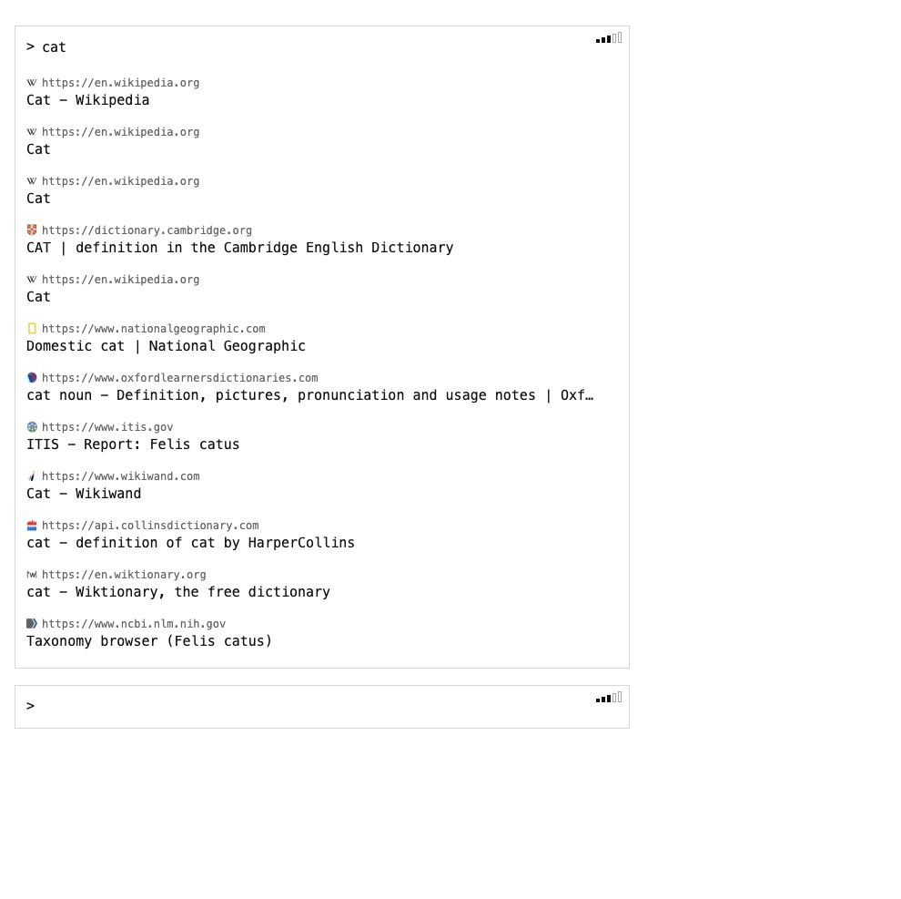

# zip.cat

zip.cat is a minimal terminal-style search interface with two command modes:

- `>` runs web search.
- `*` runs an AI prompt.

The UI is intentionally sparse: one command line, a transcript of prior commands,
right-side suggestion plugins, and keyboard shortcuts for opening results quickly.



## Features

- Fast web search through Exa.
- AI answers through OpenRouter.
- Five effort levels that select concrete generator classes, not just numeric
  options.
- Wikipedia and Wiktionary sidebar suggestions while typing.
- Markdown rendering for AI responses.
- Option shortcuts for opening search results, sidebar suggestions, and AI links.
- Editable command history: move back to earlier commands, edit them, and rerun.
- Compact terminal UI with persistent result blocks.

## Stack

- Runtime: Bun
- Server: Elysia
- Language: TypeScript
- Search provider: Exa
- AI provider: OpenRouter
- Markdown parser: marked

## Getting Started

Install dependencies:

```sh
bun install
```

Create a local `.env` file or use the shared key file loaded by the app. Required
keys:

```sh
EXA_API_KEY=...
OPENROUTER_API_KEY=...
```

Run the development server:

```sh
bun run dev
```

Open:

```text
http://localhost:3000
```

Type-check:

```sh
bun run build
```

## Effort Generators

Effort is treated as generator selection. Each level maps to a concrete web
search generator or AI generator.

### Web Search

| Effort | Generator | Exa type | Results |
| --- | --- | --- | --- |
| 1 | `ExaInstantWebSearchGenerator` | `instant` | 4 |
| 2 | `ExaFastWebSearchGenerator` | `fast` | 8 |
| 3 | `ExaAutoWebSearchGenerator` | `auto` | 12 |
| 4 | `ExaDeepLiteWebSearchGenerator` | `deep-lite` | 20 |
| 5 | `ExaDeepWebSearchGenerator` | `deep` | 30 |

### AI

| Effort | Generator | Model |
| --- | --- | --- |
| 1 | `OpenRouterGpt41NanoGenerator` | `openai/gpt-4.1-nano` |
| 2 | `OpenRouterGpt41MiniGenerator` | `openai/gpt-4.1-mini` |
| 3 | `OpenRouterAutoGenerator` | `openrouter/auto` |
| 4 | `OpenRouterGpt41Generator` | `openai/gpt-4.1` |
| 5 | `OpenRouterGpt55Generator` | `openai/gpt-5.5-20260423` |

OpenRouter models can be overridden with:

```sh
AI_MODEL_EFFORT_1=...
AI_MODEL_EFFORT_2=...
AI_MODEL_EFFORT_3=...
AI_MODEL_EFFORT_4=...
AI_MODEL_EFFORT_5=...
```

## Project Structure

```text
src/
  ai.ts                       AI request entry point
  client.ts                   Browser UI and keyboard behavior
  generators/
    base.ts                   Generic generator abstractions
    exa.ts                    Exa web search generator hierarchy
    openRouter.ts             OpenRouter AI generator hierarchy
  plugins/
    exaWebSearch.ts           Search plugin wrapper around Exa generators
    wikipediaTitle.ts         Wikipedia sidebar suggestion plugin
    wiktionaryHeadword.ts     Wiktionary sidebar suggestion plugin
  render.ts                   Server-rendered HTML and CSS
  search.ts                   Search orchestration
  server.ts                   Elysia server and API routes
```

See [USER_GUIDE.md](USER_GUIDE.md) for keyboard controls and workflows.
