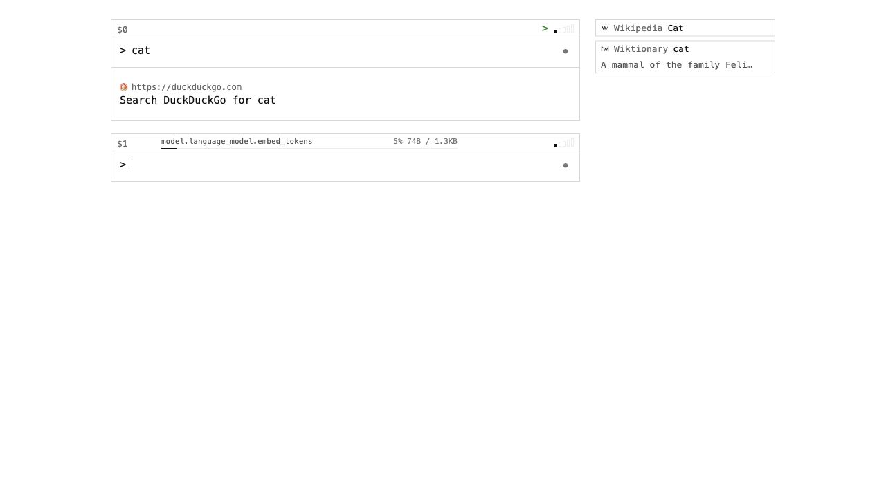
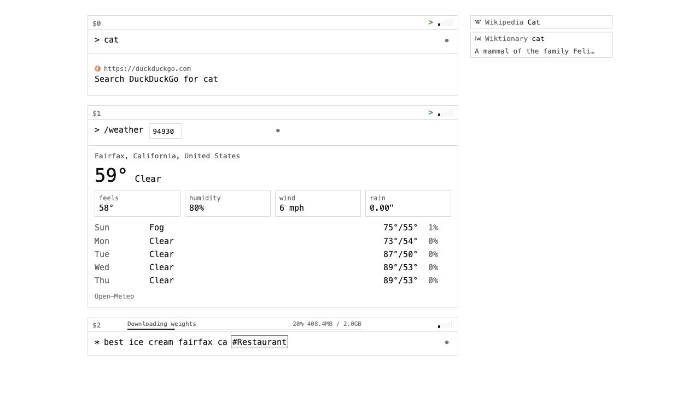
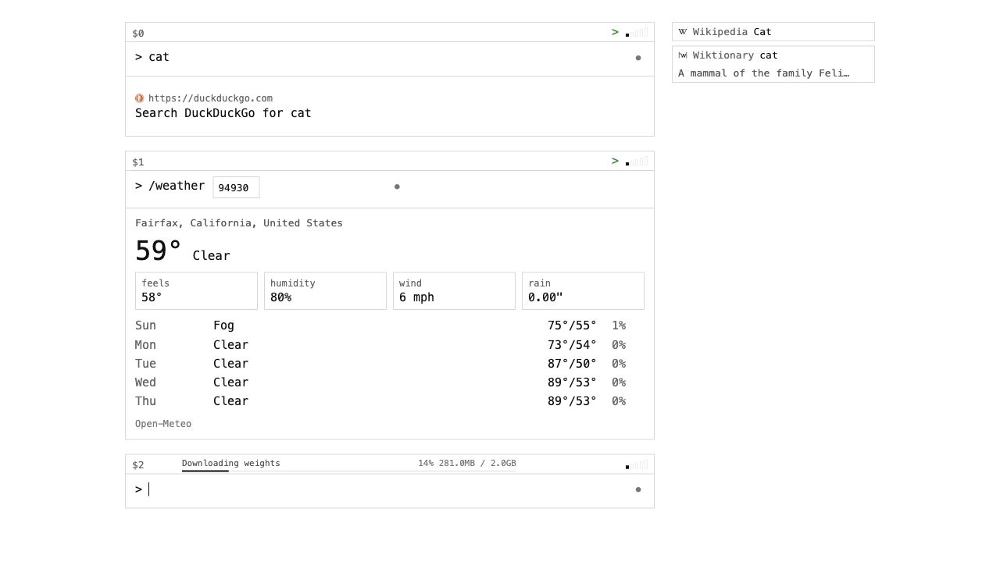

# zip.cat

Terminal search. One prompt, no chrome.

`>` searches. `*` asks AI. Results stay in editable windows named `$0`, `$1`,
`$2`, ...


## Run

```sh
bun install
bun run dev
```

Open:

- dynamic app: `http://localhost:3000`
- static-only app: `http://localhost:3001`

`bun run dev` serves both and rebuilds the static site on file changes. The user
normally runs this server locally.

Build:

```sh
bun run build
```

Cloudflare Pages output is written to `dist/static`, with server-backed `/api/*`
routes supplied by Pages Functions.

## Keys

Server mode reads env from `.env`, `~/cats/.env`, and
`~/projects/cats/.env`.

```sh
EXA_API_KEY=...
SERP_API_KEY=...
OPENROUTER_API_KEY=...
SEARXNG_URL=...   # optional: base URL of a SearXNG instance (keyless web search)
```

`SEARXNG_URL` points at a self-hosted [SearXNG](https://github.com/searxng/searxng)
instance (e.g. `http://localhost:8888`). With no `EXA_API_KEY`, every search
effort level routes to the instance instead; with both set, Exa wins and
SearXNG is the fallback. The instance must allow JSON output — include `json`
under `search.formats` in its `settings.yml`.

Optional local/server voice:

```sh
pip install moonshine-voice
```

Static mode includes no secrets. Production Cloudflare Pages keeps `EXA_API_KEY`
and `OPENROUTER_API_KEY` in Pages secrets, not in the browser bundle.

## Search

Type at `>` and press `Enter`.



Search effort:

| Level | Generator |
| --- | --- |
| 1 | DuckDuckGo Instant Answer in static/local mode; Exa Instant in server mode |
| 2 | Exa Fast |
| 3 | Exa Auto |
| 4 | Exa Deep Lite |
| 5 | Exa Deep |

Search supports:

- URL/title result rows
- favicons
- no result separators
- Option shortcuts for opening results
- sidebar Wikipedia title match
- sidebar Wiktionary headword + definition
- inline AI substitutions with `*(...)`

Example:

```text
> things to do in *(capital of france)
```

The `*(...)` spans resolve first, then the rewritten query runs.

## AI

Switch to `*`, type a prompt, press `Enter`.

Toggle mode with:

- `Right Arrow` at the end of an input
- `Left Arrow` at the start of an input

AI supports:

- Markdown rendering
- link shortcuts with Option
- OpenRouter server models
- local browser Gemma in static/local mode
- model loading progress
- threaded conversations

Threaded AI:

- `Option-Enter` in `*` mode creates a linked follow-up window.
- `Shift-Enter` inserts a newline.
- Threaded server calls send prior turns as chat messages when the provider
  supports that shape.



## Typed Outputs

Put a schema marker anywhere in an AI/search request.

```text
* dogs have legs #bool
> best ice cream fairfax ca #Restaurant
> ice cream shops marin county #Restaurant[]
```

Current schemas:

- `#bool`: renders `True` or `False`
- `#Restaurant`: renders a place/entity card
- `#Restaurant[]`: renders a list of place/entity cards

Restaurant entities are place records, not prose answers. They prefer concrete
fields such as name, category, address, phone, website, rating, and map query.

Type `#R` then `Tab` to accept the schema ghost text.

## Slash Commands

Slash commands are modular functions with arguments and typed result renderers.

Current command:

```text
> /weather 94930
```

It uses Open-Meteo and renders current conditions plus a short forecast.

`/lanes` logs into The Canon Club (Clubspot) and lists your next five days of
swim-lane reservations. It is server-only and reads `CANON_POOL_LOGIN` /
`CANON_POOL_PASSWORD` from the environment.



Type `/` at the start of the prompt to see command ghost text. `Tab` accepts a
suggestion. Wikipedia/Wiktionary suggestions are disabled for slash commands.

### Caching

Any slash command (or plugin) can opt into schema-based browser caching by
declaring a `cache` TTL on its descriptor. Output is stored in `localStorage`,
keyed by command + arguments, and validated against the command's `outputSchema`
on every read — a changed schema or malformed payload is discarded and refetched.

Within the TTL the cached result is served instantly with no network call. The
result view shows an age chip (`now` / `15m` / `3h` / `4h`) and a refresh button
(`↻`) in the upper-right that forces a fresh run. `/lanes` defaults to a 4-hour
TTL.

## Voice

Use the dot button or `Option-Space`.

- click dot: start/stop voice input
- double-click dot: choose voice engine
- static mode: browser Moonshine only
- server mode: browser Moonshine or Python Moonshine stream

The input keeps focus while toggling voice. Browser Moonshine preloads on page
load in static/local mode.

## Window References

Each window gets a label: `$0`, `$1`, ...

Use labels in AI prompts:

```text
* summarize $0
* pick the best result from $2
```

References become pills. Hovering a pill highlights the referenced window.
Referenced data is sent to AI as structured JSON with result kind and raw result
data when available.

## Shortcuts

| Shortcut | Action |
| --- | --- |
| `Enter` | Run current prompt |
| `Shift-Enter` | Newline |
| `Option-Enter` | Threaded AI follow-up |
| `Left Arrow` at start | Toggle `>` / `*` |
| `Right Arrow` at end | Toggle `>` / `*` |
| `Up Arrow` | Focus previous command window |
| `Down Arrow` | Focus next command window |
| `Option-Up` | Increase focused window effort |
| `Option-Down` | Decrease focused window effort |
| hold `Option` | Show open shortcuts |
| `Option` + shown key | Open result/suggestion/link in a new tab |
| `Option-Space` | Toggle voice |
| `Command-K` | Clear old windows, keep current input |
| double-click window | Flip debug panel |

## Debug

Double-click a result window to flip it.

Debug data includes:

- user query
- resolved `*(...)` query
- search query
- search API call and response
- typed-output shaping call
- model prompt used for shaping
- model/provider response JSON

Server failures log route, query, effort, provider/generator, error, and stack in
the server console. Secrets are not logged.

## Static Mode

Static mode is built for key-free local/browser use:

- DuckDuckGo Instant Answer API
- Wikipedia/Wiktionary browser suggestions
- `/weather`
- browser Moonshine
- browser Gemma
- no Exa/OpenRouter/SerpAPI keys

Serve it locally with:

```sh
bun run dev
# open http://localhost:3001
```

Or build only:

```sh
bun run build:static
```

## Evals

Inline substitution evals live in `evals/`.

```sh
bun run eval:inline
bun run eval:inline:openrouter
bun run eval:inline:local
```

Local Gemma evals require a runtime with WebGPU.
